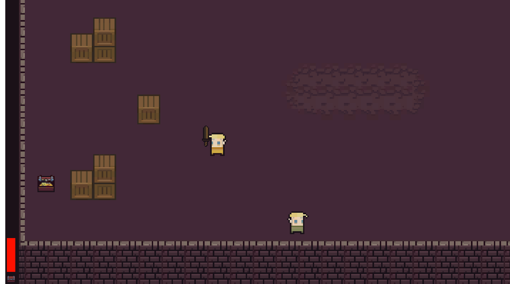
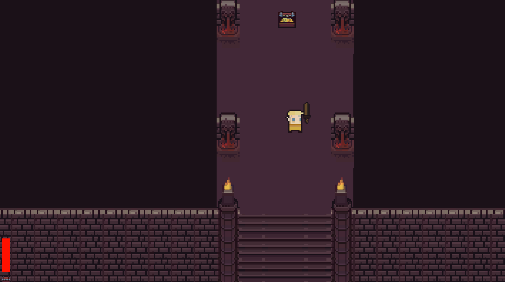
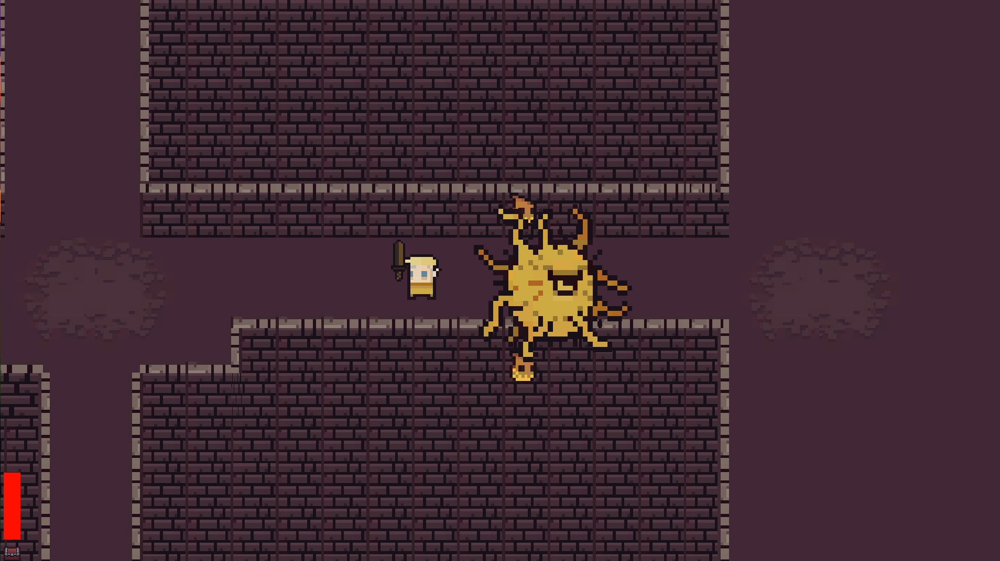

# TheUnityGame

* This game was made by watching a video, posted on YouTube, that can be found [here](https://www.youtube.com/watch?v=b8YUfee_pzc). The game is a 2D game and has a top-down perspective. Since I did not make this game all alone, I owe it to myself to thank [Michael](https://www.youtube.com/c/EpitomeGames/about). Also, I would like to thank the creators of the tileset and fonts, which both were used in the game, who can be found [here](https://0x72.itch.io/16x16-dungeon-tileset) and [here](https://www.1001fonts.com/3d-thirteen-pixel-fonts-font.html) respectively.
* This game and the one on the video has some similarities. Because I'd like to use other free-to-use assets in this game.
* This game is still in very early stages, which means that it does not contain many features, such as in-game story, in-game music etc. Because these issues were not mentioned in the video that I watch. Therefore, I will handle these issues myself.
* Since this game is the first game I made, I don't know how efficiently it was designed and how effectively the script codes were written. As a result, this game is currently in the pre-alpha phase.
* Last but not least, this game was build to run on Windows x86_64 architecture.

# Features
  * The ones in the game:
      * An basic-level implemented systems, that were used for weapons, movements and boss fights.
      * An entry-level implemented shop, that can be used to upgrade weapon.
      * A dummy instructor, that tells fundamentals of the game.
      * Two roughly designed levels.
      
  * The upcoming ones:
      * Polishing current levels.
      * Adjusting current boss-fighting system.
      * New in-game musics and stories.
      * An improved instructor, that tells the way to play the game effectively.
      * Brand new levels, new bosses etc.
      * A menu state, a pause state etc.
	  
# In-game Pictures

  

# Contributing
Pull requests are welcome. For major changes, please open an issue first to discuss what you would like to change.

# License
* I'm not sure how ethic it would be, but I would like to add a license, that is [MIT](https://choosealicense.com/licenses/mit/).
